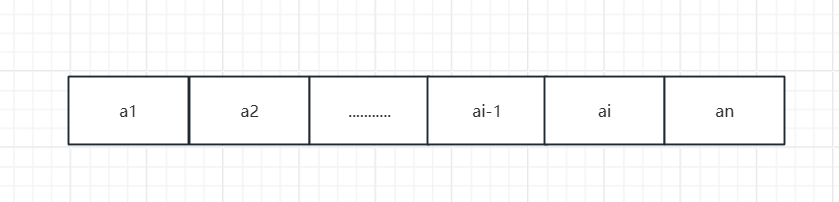
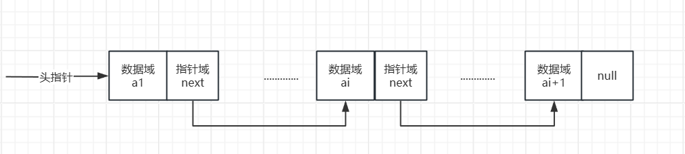

import Tabs from '@theme/Tabs';
import TabItem from '@theme/TabItem';

# 线性表

## 线性表定义

:::note[前言]
~~~
线性表: 零个和多个数据元素的有限序列！
~~~
在《大话数据结构》书中提到，一个幼儿园班级从身高小到大，一个跟着一个排队，有一个打头，有一个收尾。小朋友都知道他前面一个是谁，后面一个是谁，如同一根线把他们串起来，就可以称为线性表。
以上是《大话数据结构》书中解释。 Hare在举一个例子:
我们的吃的冰糖葫芦，一个串一个，有一个糖葫芦在签子尖打头，有最后一个在签子末尾，一个排一个位置固定。
:::

:::warning[注意]
**线性表强调，元素之间有顺序，多个元素则第一个无前驱，最后一个无后继。其他元素有且只有一个前驱和后继！而且上述两个例子都表示元素是有限的
这也是《大话数据结构》中强调说明的一点!**

 需要正确理解有序一词:  我认为它不是说元素本身按照从大到小[5,4,3,2,1]/从小到大[1,2,3,4,5]的排序的有序，而是说每个元素的前后顺序是固定的。回到之前说的一个知道后继一个知道前驱
逻辑上的有序，就算元素不是存储连续内存地址，但在逻辑上任然是有序的前后关系（需细细品味）
:::

## 线性表顺序存储结构

~~~
顺序存储结构是线性表的第一种物理存储结构，用一段地址连续的存储单元依次存储线性表的数据元素。
~~~

###  线性表的存储示意图:

### 描述顺序结构
接着我们分析下描述顺序存储结构所需要的数据:
1. 上述描述线性表是有限的，顺序存储结构则有限。so 我们定义最大的存储长度Maxsize（数组的最大存储长度）。
2. 线性表的长度 length，这个就是元素的长度，随着增删而变化。
3. 存储空间起始位置: 数组data的第一个内存地址，也就是数组下标0的位置data[0]。

### java代码实现顺序存储结构

java实现顺序存储结构

> &nbsp;&nbsp;  
~~~java
        public static void main(String[] args) throws Exception {
            LinearStructure linearStructure = new LinearStructure(5);

            linearStructure.insert(1, 0);
            linearStructure.insert(2, 1);
            linearStructure.insert(3, 2);
            linearStructure.insert(4, 3);
            System.out.println(JSON.toJSONString(linearStructure.getData()));
    
            // linearStructure.insert(5, 1);
            // System.out.println(JSON.toJSONString(linearStructure.getData()));

        }

    /**
     * 定义描述顺序结构数据
     */
    static class LinearStructure {
        // 最大存储长度
        int maxSize;
        // 存储线性表的数组
        int[] data;
        // 线性表长度
        int length;

        // 初始化
        public LinearStructure(int number) {
            // 最大数组长度
            this.maxSize = number;
            // 初始化数组data
            this.data = new int[this.maxSize];
            // this.data[0] = 1;
            // this.data[1] = 2;
            // this.data[2] = 3;
            // this.data[3] = 4;
            // 线性表 初始化长度0
            this.length = 0;
        }

        /**
         * 插入数据
         *
         * @param num 插入数据
         * @param i   插入位置（根据数组下标）
         * @throws Exception
         */
        public boolean insert(int num, int i) throws Exception {
            if (!full()) {
                if (i >= this.maxSize || i < 0) {
                    throw new Exception("暂无你说的下标!");
                }

                // 最优情况i等于this.data.length-1，每次插入到最后面O(1)
                //data[i] = num;

                // 最坏情况i等于中间or前面位置等插入 每个元素都得后移
                for (int j = this.data.length - 2; j >= i; j--) {
                    data[j + 1] = data[j];
                }
                data[i] = num;

                this.length++;
                return true;
            }
            throw new Exception("已满，插入失败~");
        }

        // 判断是否满了
        public boolean full() {
            // 判断满的情况，当线性表的长度等于数组的最大长度
            if (this.length == this.maxSize) {
                return true;
            }
            return false;
        }

        // 获取所有元素
        public int[] getData() {
            return this.data;
        }
    }
    ~~~

:::note[顺序存储结构最终分析]
1. 最优情况下: 删除，插入最后一个，不需要动其他的元素。则时间复杂度O(1)
2. 最坏情况下: 删除，插入，需要移动元素，则时间复杂度O(n)
3. 当我们获取元素时: 直接根据下标获取即可，所以此顺序存储结构适合读多，增删写少(速度慢性能影响)
:::

## 线性表链表存储结构

:::note[前言]
上述的顺序存储结构是一组连续的存储地址，但增删的时候导致需要移动大量的元素。so 链式存储结构闪亮登场！！！

直接说特点:
~~~
1. 注意链式存储结构在内存中并不是连续内存地址，为了解决顺序存储结构带来的问题，链式存储结构采用逻辑性的关联关系，你在内存什么位置不重要我逻辑上a1知道下一个是谁就行。
2. 所以a1不仅有本身的信息，还有一个指针这个指针指向下一个元素的位置。而一个元素加一个指针统称为结点Node。
3. 上述说过 线性表他是有限的，甭管你是什么链式你得有头有尾吧，所以通常把链表第一个结点的存储位置叫做头指针，指向第一个结点。而尾部指针为null继而形成有头有尾的一个单链表链式存储结构。
~~~

:::

### 单链表存储结构

java单链表链式存储结构

> &nbsp;&nbsp;  
~~~java
    // 指向第一个结点的指针
    private static Node head = new Node(null);

    public static void main(String[] args) throws Exception {

        Node node = new Node("第一个结点");
        Node node1 = new Node("第二个结点");
        Node node2 = new Node("第三个结点");
        Node node3 = new Node("第四个结点");

        // 指定第一个结点
        if (head.next == null) {
            head.next = node;
        }

        node.next = node1;
        node1.next = node2;
        node2.next = node3;

        // 获取指定元素
        getNode(node3);

        // 删除指定元素
        deleteNode(node3);

        // 打印所有结点
        listNode();
    }

    /**
     * 结点类
     */
    static class Node {
        // 结点数据域
        String data;
        // 下一个结点
        Node next;

        public Node(String data) {
            this.data = data;
        }

        public Node getNext() {
            return next;
        }

        public void setNext(Node next) {
            this.next = next;
        }

        public String getData() {
            return data;
        }

        public void setData(String data) {
            this.data = data;
        }
    }

    /**
     * 获取元素
     *
     * @param node
     */
    public static void getNode(Node node) throws Exception {
        if (empty()) {
            throw new Exception("该单项链表为");
        }
        Node target = node;
        Node nodeFirst = head.next;
        while (nodeFirst != null) {
            if (nodeFirst.getData() == target.getData()) {
                System.out.println("找到了这个元素了:" + nodeFirst.getData());
                break;
            } else {
                nodeFirst = nodeFirst.getNext();
            }
        }
    }

    /**
     * 删除指定元素
     *
     * @param node
     */
    public static void deleteNode(Node node) throws Exception {
        if (empty()) {
            throw new Exception("此链表是空的，怎么删:" + JSON.toJSONString(node));
        }
        Node target = node;
        Node nodeFirst = head.next;
        Node nodeTarget = null;
        while (nodeFirst != null) {
            if (nodeFirst.getData() == target.getData()) {
                if (nodeFirst.getNext() == null) {
                    nodeTarget.next = null;
                    break;
                } else {
                    head.next = nodeFirst.next;
                    break;
                }
            } else {
                nodeTarget = nodeFirst;
                nodeFirst = nodeFirst.getNext();
            }
        }
    }

    /**
     * 判断是不是空链表
     *
     * @return
     */
    public static boolean empty() {
        if (head.next == null) {
            return true;
        }
        return false;
    }

    /**
     * 打印所有结点
     */
    public static void listNode() throws Exception {
        if (empty()) {
            throw new Exception("此链表是一个空链表,打印什么？");
        }
        Node target = head.next;
        while (target != null) {
            System.out.println("结点打印:" + target.getData());
            target = target.next;
        }
    }
    ~~~

