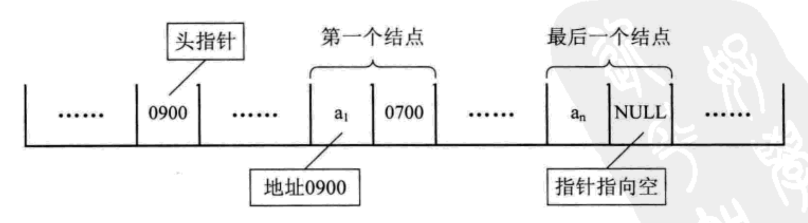
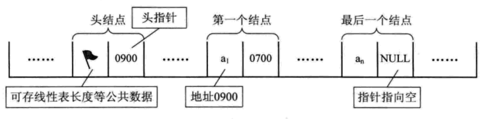

# 链式存储结构

上一篇 [顺序存储结构](../线性结构/顺序存储结构.md) 有缺点，最大的缺点就是插入和删除的时候需要移动大量的元素。非常耗费时间 
而链式存储结构就解决了这个问题。我们让元素不按照连续的内存地址存储即可，逻辑上让当前元素知道下一个元素就好了呀！

## 链式存储结构定义
&ensp;&ensp;在顺序存储结构中只要保存元素即可，而在链式存储结构中不仅要保存元素数据，还要保存它后继元素的地址。**通常我们把保存元素数据信息的域称为数据域
保存后继地址的域称为指针域。这两部分组成数据元素 称为结点(Node)。**  
&ensp;&ensp;对于线性表有限特点来说，链表存储结构也不例外，需有头有尾我们把**链表的第一个结点的存储位置叫做头指针 而最后一个结点指向"空"(Null)** 
《大话数据结构》书中图:

&ensp;&ensp;有时为了方便，我们会在第一个结点前设置一个结点，叫做头结点。头结点的数据域可以存储其他相关数据(比如链表元素个数等等)，头结点的指针域指向第一个结点的存储位置。
《大话数据结构》书中图:

### 头指针与头结点

* 头指针是指向第一个结点的指针，若链表有头结点则指向头结点的指针。不能为空。
* 头结点不一定是链表必要的，一般可保存链表元素外的数据。放在链表第一个结点前。

## 链表存储结构分类

### 单链表存储结构
通俗理解就是单方向从左往右还是从右往左，单方向的实现一个链表存储。接着我们通过代码来熟悉和练习单链表存储结构。 
为此我们实现java现有Linked List中的一些方法练习:
| 接口方法	  | 解释说明 |
| ----------- | ----------- |
| void addFirst(E element)      | 向链表头部添加一个新的元素|
| void addLast(E element)   | 向链表尾部添加一个新的元素|
| E removeFirst()   | 移除链表头部第一个元素|
| E removeLast()   | 移除链表尾部最后一个元素|
| E getFirst()   | 返回链表头部第一个元素|
| E getLast()   | 返回链表尾部最后一个元素|
| boolean contains(E element)   | 检查链表中是否包含指定元素|
| E insert(int index, E element)   | 向链表指定索引位置插入新元素|
| E get(int index)   | 返回链表中指定索引的元素|
| E set(int index, E element)   | 为链表中指定索引的元素设新值|
| E remove(int index)   | 移除链表中指定索引的元素|
| boolean remove(E element)   | 移除链表中指定的元素|
| int indexOf(E element)   | 返回指定元素所在链表的索引，元素不存在则返回-1，若存在多个相同元素，则返回第一次出现的索引下标|
| int size()   | 返回链表存储元素数量|
| boolean isEmpty()   | 检查链表是否为空|
| void clear()   | 清空链表|
| String toString()   | 返回链表的字符串形式|

#### 单链表练习

* 定义Node结点类 
一个结点包含一个数据域和一个指针域。通过Java代码我们定义一个结点类Node

Node结点类

~~~java
    class Node {
        // 结点数据域
        String data;
        // 结点指针域
        Node next;

        public Node(String data) {
            this.data = data;
        }

        public Node getNext() {
            return next;
        }

        public void setNext(Node next) {
            this.next = next;
        }

        public String getData() {
            return data;
        }

        public void setData(String data) {
            this.data = data;
        }
    }
~~~

:::warning
以下出现的head结点是初始化了一个**头指针**Node head = new Node(null);
:::

* addFirst() 
采用 **【头插法】** 每次向头部添加元素

向链表头部添加一个新的元素

~~~java
    /**
     * 每次插入到头部
     * 头插法
     * @param node
     */
    public static void addFirst(Node node){
        Node next = head.getNext();
        node.setNext(next);
        head.setNext(node);
        System.out.println(JSON.toJSONString(head));
    }
~~~

* addLast() 
采用 **【尾插法】** 每次向尾部添加元素

向链表尾部添加一个新的元素

~~~java
    /**
     * 每次插入到尾部
     * 尾插法
     * @param node
     */
    public static void addLast(Node node){
        Node next = head.getNext();
        while (next != null){
            if(next.getNext() == null){
                next.setNext(node);
                break;
            }
            next = next.getNext();
        }
        System.out.println(JSON.toJSONString(head));
    }
~~~

:::note[头插法与尾插法]
* 头插法
  * 插入速度是O(1)
  * 并发并不安全(在HashMap中1.8之前版本会体现出问题)
* 尾插法
  * 插入速度是O(n)涉及到遍历循环，实际上述讲过我们可以定义尾指针这样可达到O(1)
  * 并发相对头插法安全(在HashMap中1.8之后版本将头插法改为尾插法)
:::

* removeFirst()

删除链表第一个元素

~~~java
    /**
     * 删除第一个元素
     */
    public static void removeFirst() throws Exception {
        if(empty()){
            throw new Exception("空链表~无法删除");
        }
        head.setNext(head.getNext().getNext());
    }
~~~

* removeLast()

删除链表最后一个元素

~~~java
    /**
     * 删除最后一个元素
     */
    public static void removeLast() throws Exception {
        if (empty()) {
            throw new Exception("空链表~无法删除");
        }

        Node temp = null;
        Node next = head.getNext();
        while (next != null) {
            if (next.getNext() == null) {
                temp.setNext(null);
                break;
            }
            temp = next;
            next = next.getNext();
        }
        System.out.println("删除最后一个元素"+JSON.toJSONString(head));
    }
~~~

* getFirst()

获取链表第一个值

~~~java
    /**
     * 获取第一个元素
     */
    public static void getFirst() throws Exception {
        Node next = head.getNext();
        System.out.println("获取链表第一个元素"+ JSON.toJSONString(next));
    }
~~~

* getLast()

获取链表最后一个值

~~~java
   /**
     * 获取最后一个元素
     */
    public static void getLat() throws Exception {
        Node next = head.getNext();
        while (next != null) {
            next = next.getNext();
        }
        System.out.println("获取链表最后一个元素"+JSON.toJSONString(next));
    }
~~~

* contains()

检查链表中是否包含指定元素

~~~java
   /**
     * 查询包含是否存在元素
     */
    public static boolean contains(Node node) throws Exception {
        Node next = head.getNext();
        while (next != null) {
            if (next.getName().equals(node.getName())) {
                return true;
            }
            next = next.getNext();
        }
        return false;
    }
~~~

* insert()

在这里我把插队分为三种: 但不管怎么插入思路不变，记录node结点改变指针就行。
* 插入队首位置
* 插入队伍中间随意位置
* 插入队尾前一个位置

向链表指定索引位置插入新元素

~~~java

    /**
     * 插入结点
     *
     * @param node  插入结点
     * @param index 插入结点位置索引
     */
    public static void insertNode(Node node, Integer index) {
        int j = 1;
        Node next = head.getNext();
        Node temp = null;
        Integer nodeLength = getNodeLength();
        while (next != null) {
            if (index == j) {
                if (index == 1) {
                    head.setNext(node);
                    node.setNext(temp);
                    break;
                } else if (j == nodeLength) {
                    temp.setNext(node);
                    node.setNext(next);
                } else if (j == index) {
                    temp.setNext(node);
                    node.setNext(next);
                }
            }
            temp = next;
            next = next.getNext();
            ++j;
        }
        System.out.println(JSON.toJSONString(head));
    }
    
~~~

* get()

返回链表中指定索引的元素

~~~java

    /**
     * 返回链表中指定索引的元素
     */
    public static void get(Integer index) throws Exception {
        if (index < 0 || index >= getNodeLength()) {
            throw new Exception("索引越界");
        }

        Node next = head.getNext();
        while (index > 0) {
            next = next.getNext();
            --index;
        }

        System.out.println("获取指定索引元素" + JSON.toJSONString(next.getName()));
    }
~~~

* size()

返回链表存储元素数量

~~~java
    /**
     * 获取链表长度
     *
     * @return
     */
    public static Integer size() {
        Node next = head.getNext();
        int length = 0;
        while (next != null) {
            ++length;
            next = next.getNext();
        }
        return length;
    }

~~~

* isEmpty()

检查链表是否为空

~~~java
    /**
     * 判断链表是否为空
     * 判断头指针是否为null即可
     */
    public static boolean empty() {
        if (null == head.getNext()) {
            return true;
        }
        return false;
    }
~~~

* 指定结点查询

Node查询

~~~java

    /**
     * 查询指定结点
     * 链表没有下标，只能从头开始依次遍历。直到找到指定结点。
     *
     * @param node
     * @return
     */
    public static boolean getNode(Node node) {
        if (empty()) {
            return false;
        }
        // 获取第一个结点
        Node headNode = head.getNext();
        while (!Objects.isNull(headNode)) {
            if (headNode.getName().equals(node.getName())) {
                System.out.println("已找到指定节点:" + node.getName());
                return true;
            }
            headNode = headNode.getNext();
        }
        return false;
    }
~~~

* 删除结点

Node删除

~~~java

    /**
     * 删除第一个结点
     * 链表存储结构删除很方便，只要更改指针指向即可。
     *
     * @param
     * @return
     */
    public static void deleteFirstNode() {
        Node next = head.getNext();
        head.setNext(next.getNext());
        System.out.println(JSON.toJSONString(head));
    }

    /**
     * 删除最后一个结点
     * 循环找到最后一个结点(最后一个结点的next为null)，保存最后一个的前继结点 设置为null
     */
    public static void deleteLastNode() {
        Node next = head.getNext();
        Node temp = null;
        while (next != null) {
            if (next.getNext() == null) {
                temp.setNext(null);
                break;
            }
            temp = next;
            next = next.getNext();
        }
        System.out.println(JSON.toJSONString(head));
    }

    /**
     * 删除指定结点
     *
     * @param node
     */
    public static void deleteIndexNode(Node node) throws Exception {
        if (empty()) {
            throw new Exception("链表为null无法删除");
        }

        Node next = head.getNext();
        Node temp = null;
        while (next != null) {
            if (next.getName().equals(node.getName())) {
                temp.setNext(next.getNext());
                break;
            }
            temp = next;
            next = next.getNext();
        }
    }

~~~

#### 反转单链表
上述已经了解线性表的单链表存储结构，接下来我们可以在多加练习加深印象！ 

什么是单链表反转: 1->2->3->4->null  反转后: 4->3->2->1->null  就是这么好理解~

单链表反转

~~~java

    /**
     * 单链表反转
     * 1->2->3->4->5->null
     * 5->4->3->2->1->null
     * 
     */
    public static void nodeReversal(){
        Node next = head.getNext();
        Node node = next;
        Node temp = null;
        // 循环遍历链表
        while (next != null) {
            next = next.getNext();
            node.setNext(temp); 
            temp = node;  // 核心我们要定义temp临时变量保存已经反转
            node = next;  // 依次获取结点
        }
        head.setNext(temp);
        System.out.println("链表反转"+JSON.toJSONString(head));
    }
    
~~~

### 循环链表存储结构
**将单链表尾结点的指针由原先空指针改为指向头结点，头尾相接形成一个环就成为循环链表。**

这块不在CURD，原理和单链表都是一样的。**需要注意点是:**
* 单链表的时候while循环条件 【next != null】即可循环一遍链表。而循环链表就是【next != 头结点】的判断条件
* 不管单链表还是循环链表，访问最后一个结点都需要O(n)级别。循环链表有没有可能和访问头结点一样O(1)访问尾结点呢?
  * 这就需要定义尾指针rear(和头指针一个道理)，这样访问尾结点O(1)【rear.getNext()】 访问头结点就是rear.getNext().getNext()也是O(1)

### 双向链表存储结构

