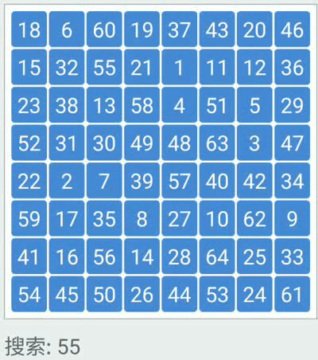

import Tabs from '@theme/Tabs';
import TabItem from '@theme/TabItem';

# 算法之二分查找

## 二分查找思想

:::note[二分查找思想]
&emsp;&emsp;&emsp;说之前我们先来玩个游戏《猜数字》，我规定范围0-100，并随机抽取一个数字63，剩下的人猜数字谁要是猜中了我随机抽取的数字63就要受罚！
假如第一个人猜65，我说大了，那么第二个人就要猜比65小的。第二个人猜33，我说小了，第三个人就要猜比33大的。第三个人猜62，我说小了
那么凑巧走到第三个人就已经很刺激了，比62大比65小，那就是[63,64]两个数字了。剩下的人靠运气喽！ 
&emsp;&emsp;&emsp;二分查找又叫折半查找，**是一种有序查找算法，必须先排序后查找！** 将首尾两位各自定义一个指针，计算出一个折半位置mid
将给定值target与折半位置mid比较有以下三种情况: 
给定数组 nums[5,6,7,9,10,14,15,56]，给定target[15]
首指针为0（下标），尾指针nums.length-1，折半位置 (left + right) >>> 1
~~~
1. target > mid
   当给定值target大于折半位置mid，说明你要找的值肯定在mid右半部分。所以我们把首指针指到(mid+1)位置缩小查找范围。 
2. target < mid
   当给定值target小于于折半位置mid，说明你要找的值肯定在mid左半部分。所以我们把尾指针指到(mid-1)位置缩小范围。 
3. target = mid
   正好等于，直接返回
~~~

:::
### 动态二分查找图

## 具体代码实现

<Tabs>
  <TabItem value="Java" label="Java" default>
    ~~~java
        public static int twoSelect(int[] nums, int target) {
        // 首指针
        int left = 0;
        // 尾指针
        int right = nums.length - 1;
        // 边界 首指针 <= 尾指针
        while (left <= right) {
            int mid = (left + right) >>> 1;
            if (target == nums[mid]) {
                return mid;
            }
            if (target > nums[mid]) {
                left = mid + 1;
            }
            if (target < nums[mid]) {
                right = mid - 1;
            }
        }
        return -1;
    }
    ~~~
  </TabItem>
  <TabItem value="Python" label="Python">
   https://pan.baidu.com/s/1pHP2QulSthS7PhKnNeQsyA?pwd=1475
  </TabItem>
</Tabs>

## 总结

二分查找

> &nbsp;&nbsp;&nbsp;&nbsp;二分查找的时间复杂度是:O(logn) n就是数组的长度，空间复杂度O(1)，在大量有序数据中查找特定的值是一个不错的选择。

