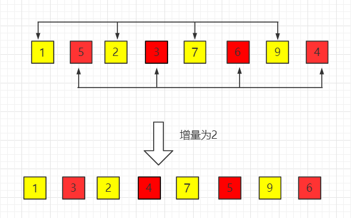

import Tabs from '@theme/Tabs';
import TabItem from '@theme/TabItem';

# 希尔排序

## 希尔排序思想
&ensp;&ensp;希尔排序是插入排序的一种改进，**又称为缩小增量排序**。其实内部还是采用插入排序进行排序，只不过待排序的记录个数变少。 
将原数组分组变成若干个子序列，每个子序列内部进行插入排序最后基本序列完成，最后一次的插入排序即可。

### 希尔排序动态图

### 希尔排序推理
1. 初始增量gap = length/2 = 4   

2. 增量缩小为 2

3. 增量缩小为 1,得到最终排序结果

## 具体代码实现

<Tabs>
  <TabItem value="Java" label="Java" default>
    ~~~java
        public static int bubbleSort(int[] param) {
        int length = param.length;
        int temp = 0;
        for (int i = 0; i < length-1; i++) {
            for (int j = 0; j < length - 1 -i; j++) {
                if (param[j] > param[j+1]) {
                    temp = param[j];
                    param[j] = param[j+1];
                    param[j+1] = temp;
                }
            }
        }
    }
    ~~~
  </TabItem>

  <TabItem value="Java最优" label="Java最优情况">
    ~~~java
    public static int bubbleSort(int[] num) {
        int length = param.length;
        int temp = 0;
        for (int i = 0; i < length-1; i++) {
            boolean flg = false;
            for (int j = 0; j < length - 1 -i; j++) {
                if (param[j] > param[j+1]) {
                    temp = param[j];
                    param[j] = param[j+1];
                    param[j+1] = temp;
                    flg = true;
                }
            }
            if(!flg){
              //那就是代表元素已经是排好的并没有进行交换
              return;
            }
        }
  // 以上代码中加入boolean控制，当第一次就没有元素进行交换，那就是说明元素本身就是有序的。**那对于时间复杂度就是线性阶:O(n)**
｝
    ~~~
  </TabItem>

  <TabItem value="Python" label="Python">
   https://pan.baidu.com/s/1pHP2QulSthS7PhKnNeQsyA?pwd=1475
  </TabItem>
</Tabs>

## 总结

### 时间复杂度

#### 最坏情况
> 假如是已经是升序排好的，现将降序排列。**那对于时间复杂度就是平方阶:O(n^2)** 
#### 最优情况
> 加入boolean控制，当第一次就没有元素进行交换，那就是说明元素本身就是有序的。**那对于时间复杂度就是线性阶:O(n)**

### 空间复杂度
> **空间复杂度就是:O(1)**

### 稳定性
冒泡排序属于稳定的排序
