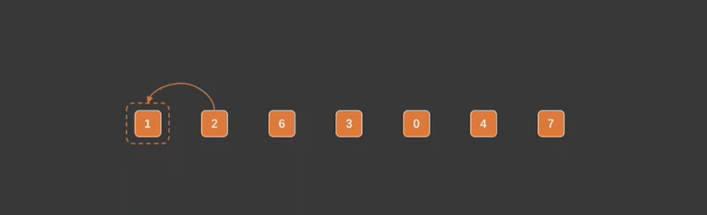

import Tabs from '@theme/Tabs';
import TabItem from '@theme/TabItem';

# 插入排序

## 插入排序思想

:::note
&ensp;&ensp;现在我们手中有九张扑克牌分别是: 5,6,7,9,10,J,Q,k,8 我们需要整理下让牌有序这也是我们打牌的习惯。可看到前八张就是有序的，最后一张8肯定需要往前排的。我们和K比 k > 8,Q > 8,J > 8 依次类推直到找到比8小的。
那 7 < 8 直接将8插入到7的后面。整副牌变为长顺子5,6,7,8,9,10,J,Q,k 
&ensp;&ensp;**以上例子就是体现了插入排序的思想: 线性表元素个数n，有序元素n1和无序元素n-1将无序元素依次和有序元素比较直到线性表n有序。**
:::

### 选择排序动态图

## 具体代码实现

<Tabs>
  <TabItem value="Java" label="Java" default>

    ~~~java
        /**
         * 插入排序
         * @param arr
         */
        public static void insertSort(int[] arr){
            int length = arr.length;
            for (int i = 0; i < length - 1; i++) {
                // 有序元素
                int sort = i;
                // 待插入的元素值
                int insert = arr[i + 1];
                for (int j = i + 1 ; j > 0 && arr[sort] > insert; j--) {
                    //  如果待插入的元素小于有序元素，则将有序元素后移
                    arr[j] = arr[sort];
                    sort--;
                }
    
                if(sort != i){
                    arr[sort + 1] = insert;
                }
            }
            System.out.println(JSON.toJSONString(arr));
        }
    ~~~
  </TabItem>
</Tabs>

## 时间复杂度
> **时间复杂度平方阶:O(n^2)，在最优的情况（本来就是有序）是O(n)**
## 空间复杂度
> **空间复杂度就是:O(1)**

## 稳定性
插入排序属于稳定的排序

