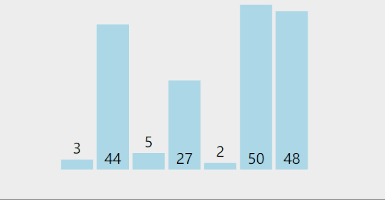

import Tabs from '@theme/Tabs';
import TabItem from '@theme/TabItem';

# 选择排序

## 选择排序思想

:::note
举一个《打擂台》例子:
一群人比试武功，那第一个上擂台的人我们称为-擂主（暂且认为他就是最强的），然后会有人上台和他比武，当擂主比武赢了接着迎接新的挑战人，当原擂主输了则下台将擂主之位给到赢的人。
一轮比较后，将擂主排在这群人的第一位（第一名不用在比试了）。接着开始以上步骤决出第二名第三名以此类推~~~ 

选择排序呢，我们可以认为数组下标0位置就是最小的或者最大的（下面我们统一叫有称号的数值），依次和剩下的数值比较，直到碰见比他还强或还弱的顶替掉它的称号。接着比试的就是和新上来的称号数值比较。一轮比较后 
将数组下标0位置替换为称号的数值。依次类推~
:::

### 选择排序动态图

## 具体代码实现

<Tabs>
  <TabItem value="Java" label="Java" default>
    ~~~java
    public static void selectSort(int[] nums) {
        int temp = 0;
        for (int i = 0; i < nums.length - 1; i++) {
            int min = i;
            for (int j = i + 1; j < nums.length; j++) {
                if (nums[min] > nums[j]) {
                    min = j;
                }
            }
            if (min != i) {
                temp = nums[i];
                nums[i] = nums[min];
                nums[min] = temp;
            }
        }
        System.out.println(Arrays.toString(nums));
    }
    ~~~
  </TabItem>
</Tabs>

## 时间复杂度
> **时间复杂度就是平方阶:O(n^2)**
## 空间复杂度
> **空间复杂度就是:O(1)**

## 稳定性
选择排序属于不稳定的排序

:::warning
对于冒泡排序来说，选择排序的交换次数要比冒泡的少。所以性能方面也要比冒泡优越一点。
:::
